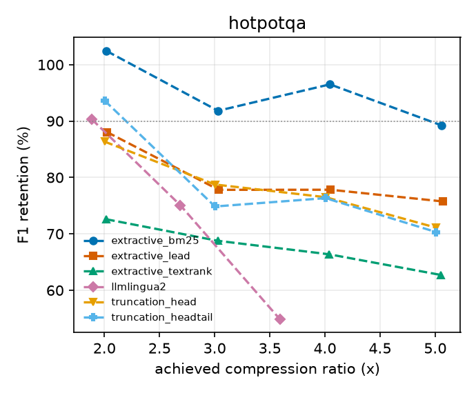

# Results

> **Snapshot, 2026-10-06, partial.** Generated from the baseline run only (`runs/m1_baselines`,
> 200 examples per dataset). Only the datasets listed in the tables below had finished, and
> LLMLingua-2 is missing at some ratios. **No learned compressor has been trained yet**, so every
> hypothesis section (H1-H4) is empty. Regenerate this page with
> `python -m gistgraph report runs/*` once runs exist.

## How to read these results

- Every number comes from `results.jsonl` files produced by the commands in the README. F1
  differences are paired by example and shown with a 95% bootstrap interval over examples; `*`
  marks an interval that excludes zero. Intervals reflect example sampling only: with one training
  seed per model they do **not** include training-run variance.
- Methods are compared at the compression ratio they *achieved* (shown in brackets), not the one
  requested. Query-aware baselines (`extractive_bm25`) see the question; the learned compressors
  do not.
- The frozen LLM is a 0.5B model, so absolute F1 is low and retention is relative to its own
  full-context behaviour.

## Retention at every ratio

### Full-context reference

| dataset | n | F1 | EM |
|---|---|---|---|
| hotpotqa | 200 | 30.3 | 18.0 |

### F1 retention (achieved ratio in brackets)

| dataset | method | 2x | 3x | 4x | 5x |
|---|---|---|---|---|---|
| hotpotqa | extractive_bm25 | 102% (2.0x) | 92% (3.0x) | 97% (4.0x) | 89% (5.1x) |
| hotpotqa | extractive_lead | 88% (2.0x) | 78% (3.0x) | 78% (4.1x) | 76% (5.1x) |
| hotpotqa | extractive_textrank | 73% (2.0x) | 69% (3.0x) | 66% (4.0x) | 63% (5.1x) |
| hotpotqa | llmlingua2 | 90% (1.9x) | 75% (2.7x) | 55% (3.6x) | - |
| hotpotqa | truncation_head | 86% (2.0x) | 79% (3.0x) | 77% (4.0x) | 71% (5.0x) |
| hotpotqa | truncation_headtail | 94% (2.0x) | 75% (3.0x) | 76% (4.0x) | 70% (5.0x) |

## H1: does structure beat flat slots?

Graph model against each control. The graph model has edges and message passing; `graph_noedges` has the same parameters but empty messages; `graph_random` has a random graph of equal degree; `routed_adaptive` has neither.

**graph vs flat**

_No overlapping results for `graph` and `flat` yet._

**graph vs graph_noedges**

_No overlapping results for `graph` and `graph_noedges` yet._

**graph vs graph_random**

_No overlapping results for `graph` and `graph_random` yet._

**graph vs routed_adaptive**

_No overlapping results for `graph` and `routed_adaptive` yet._

## H2: adaptive routing versus a fixed rate

_No overlapping results for `routed_adaptive` and `routed_fixed` yet._

Per-document memory length at 4x (a fixed-rate model has none):

_No results yet._

## H3: where does structure help? (4x)

_No overlapping results for `graph` and `flat` at 4x yet._

## H4: incremental versus one-shot

**graph+stream4 vs graph**

_No overlapping results for `graph+stream4` and `graph` yet._

**graph+stream2 vs graph**

_No overlapping results for `graph+stream2` and `graph` yet._

**routed_adaptive+stream4 vs routed_adaptive**

_No overlapping results for `routed_adaptive+stream4` and `routed_adaptive` yet._

**routed_adaptive+stream2 vs routed_adaptive**

_No overlapping results for `routed_adaptive+stream2` and `routed_adaptive` yet._

**graph_stream+stream4 vs graph_stream**

_No overlapping results for `graph_stream+stream4` and `graph_stream` yet._

**graph_stream+stream2 vs graph_stream**

_No overlapping results for `graph_stream+stream2` and `graph_stream` yet._
